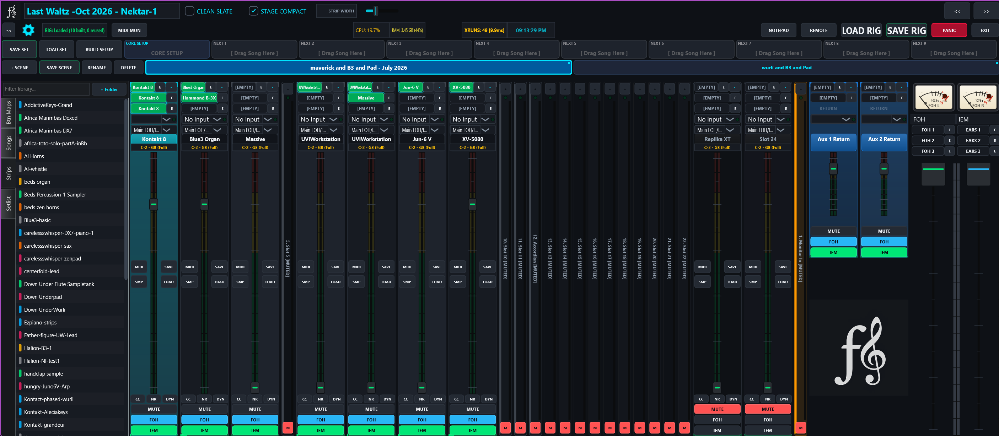
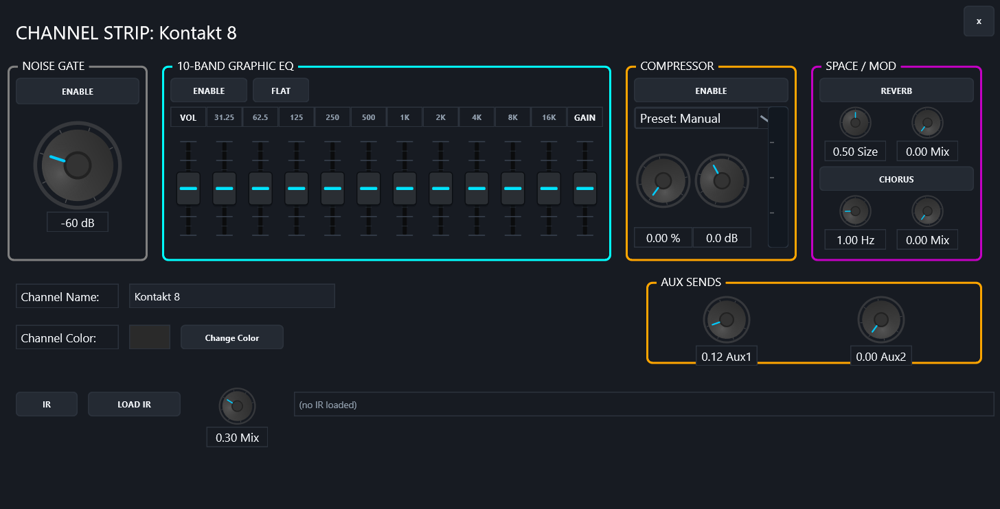

<div align="center">

# Fanfare

### The Sovereign Live Performance Engine

[](https://github.com/openrig-host/openrig/releases/latest)
[](https://github.com/openrig-host/openrig/releases)
[](https://www.gnu.org/licenses/gpl-3.0.html)

A rack-based VST3 host (and MIDI router) built for one job: getting you through a live set without a single dropout, a stuck note, or a fumbled song switch.

[Download](#download) · [Getting Started](GETTING_STARTED.md) · [Features](#features) · [How It Works](#how-it-works) · [Tested Plugins](#tested-vst-compatibility) · [Make It Yours](#make-it-yours) · [Roadmap](#roadmap)

<br/>



</div>

---

> ## ⚠️ Read this before you use it live
>
> **Fanfare is a personal project.** It was built by one keyboardist for one keyboardist's own stage rig. It's shared here in case it's useful to anyone else, but it comes with **no warranty, no support SLA, and no compatibility promise** beyond the plugin and hardware list below.
>
> **If you intend to use this on a paid gig, you must:**
> 1. Run it for at least a week of rehearsals with **your** actual songs, **your** actual VSTs, and **your** actual hardware.
> 2. Stress-test song switches, scene changes, and panic-button scenarios under live conditions.
> 3. Have a backup plan (a second laptop, a hardware fallback, a way to bail out).
>
> The author can only vouch for compatibility with the [VSTs they personally use](#tested-vst-compatibility). Other plugins may work, may partially work, or may crash the audio thread. There are known special cases — see the plugin list.
>
> ---
>
> ### 🤖 Honest disclaimer
>
> This is a vibecoded app. AI agents wrote most of it. It has bugs. It will have more bugs tomorrow. It might crash on a plugin you've never tried.
>
> **But it also does some genuinely cool things that commercial stage-rig software doesn't**, because it was designed for one specific live setup instead of trying to please everyone — atomic song switches, rollback-by-construction, dual-bus per slot, a panic button that actually works.
>
> If you find a bug, the answer is right there in the source: fix it, rebuild, ship your own version. That's the point of [Make It Yours](#make-it-yours) below. :)

---

## What is Fanfare?

Fanfare is a Windows desktop application that hosts your VST3 instruments and effects in a fixed, predictable linear rack — the way hardware works. No virtual patch cables. No node graphs. No "let me just click 4 things and I'll have a snare."

It's built around the realities of playing a keyboard live:

- **Splits. Triggering samples. Arpeggiators. Octaves and harmonizers. Set, and forget.**
- **You can't reload a song in the middle of a verse.** Songs switch in the background, atomic, with rollback if something goes wrong.
- **The sound guy and the in-ear mix are not the same mix.** Every slot sends independently to FOH and IEM.
- **A stuck note cannot end the show.** A panic button kills all MIDI in one audio block. Always. Instrument swaps fade the old sound out and send an all-notes-off drain, so a held chord never hangs.
- **Your modwheel must hit the B3X and only the B3X.** Per-slot MIDI channel routing, CC remapping, and full arm-then-wiggle CC learn.
- **A button should be a switch, not a fader.** Any CC binding can latch: press on, press again off — parameters, mutes, or A/B swaps between loaded plugins.
- **Some sounds live in hardware, not plugins.** Any slot can send MIDI OUT to an external synth/module instead of hosting a VST.
- **The next song needs to be ready before you call it.** Setlists preload the next rig in a background thread while you play.
- **Between sets is still the show.** A built-in dual-deck break-music player with YouTube grab, BPM display, and a smart BPM-aware playlist arranger.

This is not a DAW. It's a stage instrument.

---

## Quick Start

1. **Download the latest release**: Grab `Fanfare.exe` from [GitHub Releases](https://github.com/openrig-host/openrig/releases/latest) (no installer required).
2. **Configure your Audio & MIDI**: Open `Settings`, select your **ASIO** driver (or WASAPI), and enable your primary MIDI keyboard controller.
3. **Load a Rig or Build a Slot**: Click **LOAD RIG** to open a setlist/song, or click **[EMPTY]** on any strip slot to load a VST3 plugin instrument.
4. **Set Up Key Range & MIDI Learn**: Click **NR** on a strip to set key split range via play-to-learn, or **CC** to open the CC Assignment Manager — arm-and-wiggle map your hardware knobs, or hold **MUTE / FOH / IEM** on the strip to learn those directly.

> For a full step-by-step walkthrough, see **[GETTING_STARTED.md](GETTING_STARTED.md)**.

---

## Features

### The Rack
- **Linear, fixed slot layout** — 24 slots, one instrument each, in a known order. No clicks, no surprises.
- **Dual-bus mixing on every slot** — independent FOH (Front of House) and IEM (In-Ear Monitor) levels, mutes, and enables.
- **Per-slot MIDI channel routing** — global default + per-slot override. Send a CC to one instrument and *only* that instrument.
- **Per-instrument stacking** — multiple instances of the same plugin in a slot, with individual level, note range, and enable.
- **Boutique dark-mode UI** — skeuomorphic knobs, glassy panels, no virtual-cable spaghetti. Click the mixer's logo area to fly in your own branding image.

### Songs, Scenes & Setlists
- **Songs (Rigs)** — a complete patch: plugins, states, channel strips, CC maps, levels. Saved as versioned JSON.
- **Scenes** — variations within a song (verse / chorus / bridge). Snapshot, recall, and MIDI-trigger them via program change.
- **Setlists** — ordered queue of songs with one-click load and **automatic preload of the next rig** on a worker thread.
- **Atomic transitions** — the new rig is built and validated off-thread, then swapped in under lock. A failed build never touches the live rig.
- **Rollback-by-construction** — if anything in the build fails, the current rig keeps playing. No half-loaded songs, ever.
- **Clean-slate mode** — opt to fully unload the old rig before building a heavy new one.

### MIDI
- **Arm-then-wiggle CC learn** — open the CC Assignment Manager, click Learn, move the physical control, it's bound. Range, min/max, invert, and per-parameter index all supported.
- **Latch mode (TOG)** — mark any parameter binding as a toggle: press once = Max, press again = Min. Works with momentary and alternating buttons.
- **Per-strip mute toggle** — learn a CC that mutes/unmutes the whole strip, same press-edge semantics.
- **Instrument swap** — one CC alternates which of two chain slots is enabled (both plugins stay loaded). The benched plugin fades out over ~80 ms and receives an all-notes-off drain, so swapping mid-chord never leaves stuck notes.
- **Long-press learn** — hold MUTE / FOH / IEM on any strip to arm the matching learn instantly.
- **Scene MIDI triggers** — assign a Program Change + channel to any scene. Hardware sequencer calls the song.
- **MIDI monitor** — see what your keyboard is actually sending, with learn-capture overlay.
- **MIDI OUT slots** — any chain slot can send filtered MIDI to hardware instead of hosting a plugin.

### DSP & Effects


- **Per-slot channel strip** — noise gate, high-pass + low/high shelves, compressor, chorus, convolution **IR reverb** (load your own impulse response), all toggleable per slot.
- **Sampler with waveform splice editor** — load a WAV, set root note, trim the start/end with sample-accurate handles.
- **Arpeggiator** — patterns (Up / Down / Up-Down / Random), 0–4 octave range, gate time, BPM-locked to 1 decimal.
- **Octave harmonizer** — generate sub/up octaves with mode shaping.
- **MIDI effects** — transposer and friends, per slot.
- **Master FOH and IEM FX buses** — global reverb / EQ / compression before the outputs.

### Between Sets
- **Dual-deck break-music player** — two decks with BPM display, gain/level, per-track in/out cue trimming, and a smart BPM-aware playlist auto-arranger.
- **YouTube grab** — paste a link, download as MP3 192k, straight into the playlist.
- **Music library database** — embedded SQLite with CSV/JSON/M3U export.
- **Gig Notepad** — per-show notes alongside the rig.
- **Web companion** — remote control from a phone/tablet browser on the same network.

### Live Reliability
- **Panic button** — instantly sends All Notes Off to every plugin, in the next audio block. Hardware-fail-safe.
- **Parallel, hang-proof loading** — plugins build concurrently, interleaved by engine. Same-plugin instances serialize on a per-path gate; NI plugins (Kontakt) restore on the GUI thread exactly like interactive loads; a plugin that stalls past its timeout is skipped and poisoned for the session instead of taking the rig down.
- **Atomic JSON persistence with .bak** — every rig save writes to a temp file, renames atomically, and keeps a backup of the previous version. Crashes during save cannot corrupt your library.
- **SEH-protected message loop** — if a misbehaving VST3 (Qt-based plugins in particular) crashes, the engine survives and the show goes on.
- **Per-plugin exception isolation** — one plugin throwing inside `processBlock` cannot kill the audio thread. The slot mutes; the rest of the rig keeps playing.
- **Versioned rig format with migration** — v1 rigs auto-upgrade to v2. Unknown future versions are refused, not silently misinterpreted.

### Persistence
All data lives under `%APPDATA%/Fanfare/`:

| Folder    | Contents                          |
| --------- | --------------------------------- |
| `songs/`  | Rig files (`.json`)               |
| `sets/`   | Setlists                          |
| `backups/`| Auto-rotated `.bak` of rigs       |
| `settings/`| User preferences, MIDI maps      |

The `.exe` is fully standalone — no external asset files. SVG icons are embedded.

---

## How It Works

```
                       Keyboard
                                │  MIDI
                                ▼
        ┌──────────────────────────────────────┐
        │            Fanfare Engine            │
        │   ┌─────┬─────┬─────┬─────┬─────┐   │
        │   │ S0  │ S1  │ S2  │ S3  │ ... │   │  ← Linear rack
        │   │ Mon │Kbd  │Organ│VSTi │Aux  │   │     (no cables)
        │   └─────┴─────┴─────┴─────┴─────┘   │
        │         │ FOH       │ IEM            │  ← Dual bus
        │         ▼           ▼                │
        │   Master FOH    Master IEM           │
        │     FX bus        FX bus             │
        └──────┬──────────────┬────────────────┘
               │              │
               ▼              ▼
           FOH Out        IEM Out
```

**Switching a song:**

1. SetlistManager calls `RigTransitioner::transitionToFile(nextSong)`.
2. `RigBuilder` collects every plugin in the new rig and builds them in parallel on worker threads, interleaved by engine; same-plugin instances serialize on a per-path gate, and single-instance plugins (NI Kontakt, Super 8) instantiate and restore state on the GUI thread.
3. Each new instance is validated with a silent `processBlock`.
4. The transitioner takes the callback lock, **swaps pointers only** (no allocations, no state restore on the audio thread), and signals the message loop.
5. The old rig is unloaded. New rig is live. The loading overlay covers it.
6. If a build fails, the lock is never taken. The current rig keeps playing. *You will not know anything happened, by design.*

---

## Tested VST Compatibility

> **The author can only vouch for the plugins below.** These are the VSTs in the engine's hardcoded plugin registry, which is what the rig builder will scan for by default. If your VST isn't on this list, you can add its path manually — but it is **your** responsibility to test it.

### Verified working

| Plugin | Vendor | Notes |
|---|---|---|
| **Hammond B-3X** | Hammond / SkyLabs | The organ. Has a custom note-range filter (top/bottom of keyboard cut). |
| **Kontakt 8** | Native Instruments | Heavy sampler. Builds on the GUI thread; restores large multis in seconds that used to deadlock off-thread. |
| **Super 8** | Native Instruments | Qt-based. Aborts if instantiated twice; reuse-by-path is mandatory. |
| **Supercharger GT** | Native Instruments | Bus compressor. |
| **Omnisphere** | Spectrasonics | Aux-bus layout is non-standard; engine skips strict layout enforcement for it. |
| **UVI Workstation** | UVI | Sampler. |
| **Syntronik 2** | IK Multimedia | Synth rompler. |
| **JUNO-106** | Roland | Synth. |
| **ZENOLOGY** | Roland | Synth. |
| **XV-5080** | Roland | ROMpler. |
| **Jun-6 V** | Arturia | Synth. (Threw `CException` once during state restore; the engine catches and isolates it.) |
| **Replika XT** | Arturia | Delay. |
| **Chorus JUN-6** | Arturia | Modulation. |
| **Pre 1973** | Arturia | Preamp. |
| **Pre TridA** | Arturia | Preamp. |
| **Bus EXCITER-104** | Arturia | Bus processor. |
| **Bus FORCE** | Arturia | Bus processor. |
| **Bus PEAK** | Arturia | Bus processor. |
| **MixBox** | IK Multimedia | Channel strip / multi-FX. |
| **Blue3 Organ** | Cherry Audio | Tonewheel organ. |
| **PolyMax** | Universal Audio | Synth. |
| **bx_meter (VU)** | Brainworx | Metering. |
| **bx_console Focusrite SC** | Brainworx | Channel. |
| **TR5 Metering** | IK Multimedia | Metering. |
| **TR5 British Channel** | IK Multimedia | Channel. |
| **TR5 White Channel** | IK Multimedia | Channel. |
| **EZkeys 2** | Toontrack | Piano. |

### Known-broken / special-case

- **Qt-based VST3s** (e.g. NI Super 8) — must be built on the message thread, not a worker thread, and the engine reuses plugin instances by path. This is hard-coded in the engine.
- **NI plugins in general** — Kontakt restores state on the GUI thread; background-thread `setStateInformation` on a second instance of the same plugin deadlocks. Handled automatically.
- **VST3s that call back into the host on `prepareToPlay`** — engine wraps this in `try/catch(...)`. A failed plugin is logged and skipped, the rig applies with the rest.
- **VST3s that stall indefinitely** — each build has a 600 s timeout; after that the entry is skipped and that plugin path is not retried for the rest of the session. The rest of the rig still loads.

### Hardware tested

- **Yamaha CK88** (88-key controller with drawbars)
- **Roland RD88** (controller, send only)
- **Nektar LX61+** (compact primary controller)
- **Arturia KeyLab 88 Essential**
- A generic ASIO audio interface

Other keyboards will work as MIDI sources, but the per-slot MIDI channel routing has only been exercised with these.

---

## Download

Pre-built Windows binaries (with **ASIO support**) are on the [Releases page](https://github.com/openrig-host/openrig/releases). The download is a ready-to-run `Fanfare.exe` — no installer, no build step.

> Binaries are built locally by the author and uploaded by hand to each Release. There is no auto-build: the ASIO build can't be produced on a public CI runner because ASIO requires Steinberg's proprietary SDK.

**Latest release:** https://github.com/openrig-host/openrig/releases/latest

### Requirements
- Windows 10 / 11 (64-bit)
- A VST3-compatible sound card / audio interface
- An **ASIO driver** for your interface (recommended for live use). Without one, the engine falls back to WASAPI.

### Compiling it yourself

> ⚠️ **ASIO SDK licensing:** the Steinberg ASIO SDK headers **cannot be bundled** in this repository. Before building with ASIO, download the SDK yourself from the official [Steinberg Developer Portal](https://www.steinberg.net/developers/) (free), then extract its header files into:
> ```
> C:\JUCE\modules\juce_audio_devices\native\asio\
> ```
> This exact path is required — it's where the project's `AppConfig.h` looks. (This is also why there's no auto-build: the ASIO SDK can't live in a public repo or run on CI.)

To build, you need:
1. **Visual Studio 2022+** with the "Desktop development with C++" workload
2. **[JUCE 8](https://juce.com)** installed at `C:\JUCE`
3. **Steinberg ASIO SDK** — downloaded and placed as above (VS route, ASIO builds only)

Then open `Builds\VisualStudio2026\Fanfare.sln` in Visual Studio, set **Release / x64**, and build. Output: `Fanfare.exe`.

For the full walkthrough (incl. the CMake no-ASIO path, troubleshooting, and the command-line MSBuild equivalent), see **[BUILDING.md](BUILDING.md)**.

---

## Make It Yours

**The whole source tree is here. Fork it, modify it, ship your own version.**

This codebase was developed end-to-end with AI coding tools ([Antigravity](https://antigravity.dev) and KiloCode, powered by Gemini, Claude, Minimax, Zai, and Xiaomi). That's not a marketing claim — it's a workflow. The intended way to use this repo is:

1. **Download the source** (green "Code" button → "Download ZIP", or `git clone`).
2. **Unzip it on your machine.**
3. **Point Antigravity at the folder** (or any other AI coding agent that can read a C++/JUCE codebase).
4. **Ask for what you want.** For example:
   - *"Add a new VST to the plugin registry in FanfareEngine.h."*
   - *"Add VST2 hosting alongside VST3."*
   - *"Add a transpose-offset knob to the channel strip."*
   - *"Migrate the JUCE 8 code to JUCE 9 when it ships."*
   - *"Fix this crash when I load my Arturia plugin."*
5. **Iterate.** The agent has the full source — types, comments, architecture docs, the lot. It can make real changes, not just stubs.

The author's tool of choice is Antigravity, but anything that can read a JUCE 8 / C++17 codebase will work. You will need the build environment described in [BUILDING.md](BUILDING.md) (Visual Studio, JUCE 8, and the Steinberg ASIO SDK) to compile whatever the agent produces.

**If you build something useful, a PR back is welcome but not required** — *unless* you distribute your modified version, in which case the [GPL v3](LICENSE) requires you to publish your changes under the same license. Personal/private use has no such obligation.

---

## Philosophy

A few principles drove every design decision:

1. **Predictability over flexibility.** A stage rig is not a sketchbook. Slots are fixed. Routing is fixed. You know exactly what sound comes out of which key, every time.
2. **The worst-case failure must be a no-op.** A song switch that fails should leave the current rig playing. A plugin crash should leave the other slots playing. A panic button must work in the next audio block, always.
3. **Background work, foreground feel.** Plugin loading, preloading, MIDI mapping, persistence — none of it blocks the audio thread, and as little as possible blocks the message thread.
4. **Own your data.** Rigs are JSON. Backups are automatic. There is no cloud, no account, no telemetry. Your setlist is a folder of files you can read, edit, version-control, and back up with any tool.

---

## Roadmap

- [x] **Theme engine** — 5 selectable themes including a light theme
- [x] **Parallel plugin loading** with per-path serialization and GUI-thread restore for NI plugins
- [x] **CC latch/toggle mode, mute toggles, long-press learn, instrument swap**
- [ ] **DPI-aware layout** for HiDPI stage displays
- [ ] **Out-of-process plugin hosting** (current SEH wrapper is containment, not isolation)
- [ ] **Touch-friendly mode** for tablet second screens

---

## License

**Fanfare is licensed under the [GNU General Public License v3.0](LICENSE).**

The GPL v3 was chosen deliberately: the Steinberg ASIO SDK — which Fanfare links for low-latency audio — is offered under GPL v3 as an alternative to its proprietary license. By licensing Fanfare under GPL v3, the published ASIO-enabled binaries are compliant with the ASIO SDK's terms **without** needing a separate signed agreement from Steinberg.

What that means in practice:
- You're free to use, study, modify, and redistribute Fanfare, including the ASIO builds.
- If you **distribute** a modified version (binary or source), you must release your changes under GPL v3 and make the corresponding source available.
- The ASIO SDK itself still may not be redistributed in this repo — builders download it themselves per [BUILDING.md](BUILDING.md).

## Credits

Built with [JUCE 8](https://juce.com).

Created with [Antigravity](https://antigravity.dev) and KiloCode, powered by [Gemini](https://deepmind.google/technologies/gemini/), [Claude](https://anthropic.com), Minimax, Zai, and Xiaomi.
